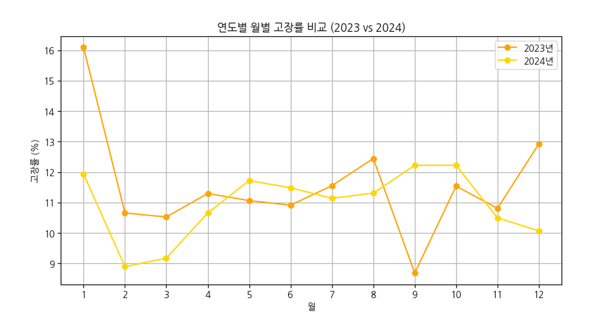
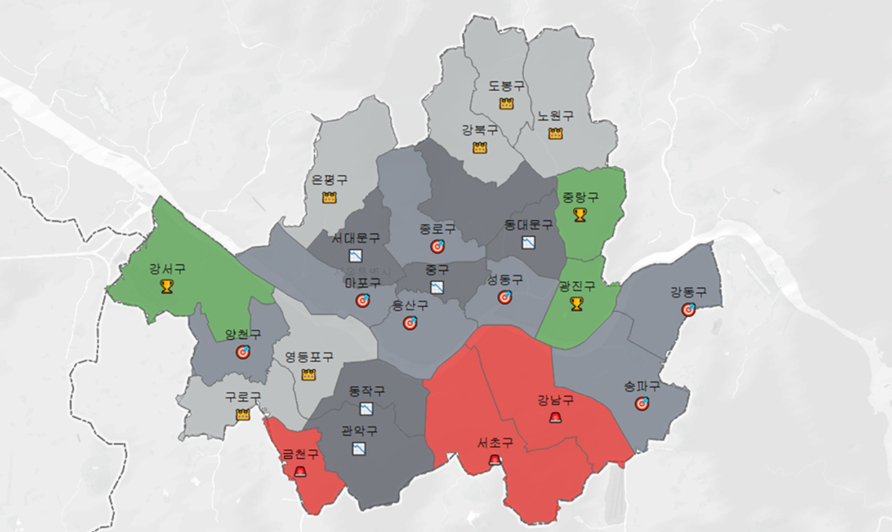
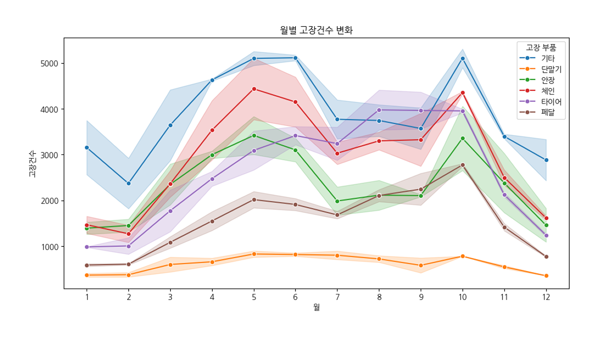
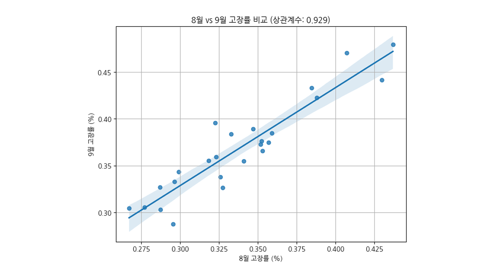
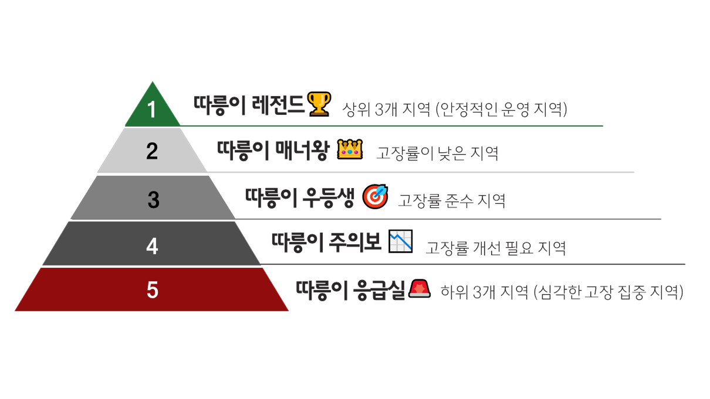
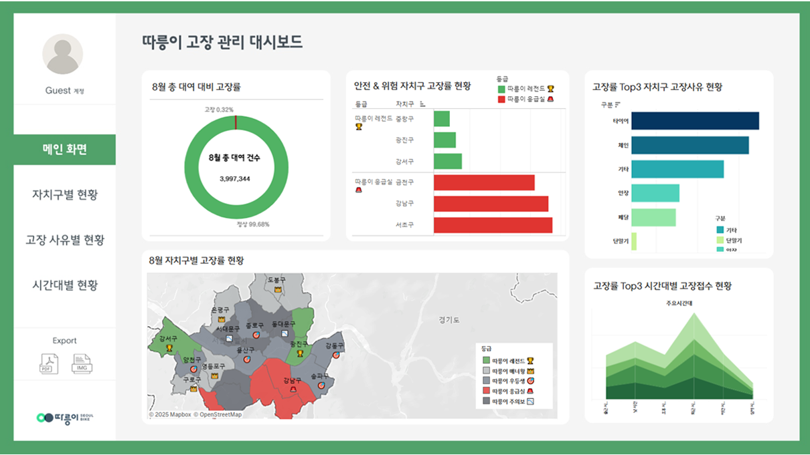

# 🚲 따릉이 고장률 분석 및 정비 전략 수립 프로젝트

### 분석 카테고리: 비즈니스 데이터 분석
> **분석 기간** &nbsp;|&nbsp;  2025.02.13 - 2025.02.27 <br/>
> **분석 주체** &nbsp;|&nbsp;  팀 프로젝트 (팀원: 김영경, 윤희상, 위이태인) <br/>
> **분석 기법** &nbsp;|&nbsp;  고장 패턴 분석, 통계 기반 가설 검정, 정비 전략 설계, 시각화 대시보드 기획 <br/>
> **분석 기술** &nbsp;|&nbsp;        


---

## 0. 프로젝트 구성 안내

### 📂 디렉토리 구조

```plaintext
📁 Daerungi_Fault_Analysis/
 ┣ 📁 data/              원천 데이터 (고장신고, 대여이력, 대여소 정보 등)
 ┣ 📁 notebooks/         분석 코드 (Colab)
 ┣ 📁 images/            시각화 결과 (지도, 그래프 등)
 ┣ 📁 reports/           요약 보고서 및 발표자료 (PDF)
 ┣ 📄 README.md          프로젝트 설명 문서
 ┗ 📄 requirements.txt   사용한 Python 패키지 목록

```

---
## 1. 프로젝트 개요

### 📌 세 줄 요약
- 2024년 9월 따릉이 고장률 급증 현상을 분석하고 원인을 규명했습니다.  
- 자치구, 시간대, 부품별 고장 패턴을 추출하고, 2025년 여름철 정비 전략을 수립했습니다.  
- 고장 다발지역 등급화 및 탄력적 사전 정비팀 운영안을 제시하고, 관리 대시보드 설계를 통해 운영팀 커뮤니케이션 효율을 높였습니다.

---

## 2. 문제 정의 및 접근 방식

### 🔍 Situation
- 2023년 9월에는 고장률이 안정적이었으나, 2024년 9월에 급격히 상승  
- 기존 정비 방식의 한계와 여름철 기상 요인이 복합적으로 작용한 것으로 추정됨  

### 💡 Task  
- 고장 다발 요인을 규명하고, 자치구 및 시간대별 정비 전략 수립  

### 🏃  Action
- 3개년 고장신고·대여 로그 분석, 자치구 등급화, 고장 부품 분류, 시간대별 신고량 분석  
- 탄력적 사전 정비팀 운영안 및 시각화 기반 대시보드 설계  

### 🚀 Result
- 공간·시간·부품 3요소 기반의 정비 전략 도출  
- ‘따릉이 등급제’와 인력 배치 시나리오 제공  
- 운영팀의 의사결정에 활용 가능한 실시간 대시보드 구축  

---

## 3. 프로젝트 진행

### 3-1) 📊 EDA 요약

- 월별 고장신고량 분석: 2024년 9월에 전년 대비 2배 이상 증가

  
  
- 자치구별 고장률 상위 지역: 서초, 강남, 금천

  
 
- 고장 부품 상위: 타이어 > 체인 > 브레이크

  

---

### 3-2) 🧪 가설 검정: 고장률 상승 원인 분석

H1. 8월 고장률이 9월 고장률에 영향을 준다
↳ 자치구별 8월 고장률과 9월 고장률 간 회귀 분석을 통해 선형 상관성 확인
- 8월에 고장률이 높았던 지역일수록 9월 고장률도 통계적으로 유의미하게 높은 경향 확인

  

H2. 기온이 상승할수록 고장률도 증가한다
↳ 3개년 8월 평균 기온과 고장 건수 간 피어슨 상관계수 분석
- 기온 상승과 고장률 사이에 양의 상관관계 존재 (r > 0.6)

---

### 3-3) 🔧 Action Plan 도출

정량 분석을 통해 드러난 자치구별, 부품별, 시간대별 고장 패턴을 바탕으로 운영팀이 즉시 실행 가능한 정비 전략을 제안하였습니다.

#### ① 자치구별 등급화 및 우선 순찰 전략
- 고장률에 따라 5등급(레전드~응급실)으로 분류
- - 고장 다발 지역(서초·강남·금천구 등) 우선 대응

  

#### ② 부품별 사전 점검 강화
- 고장 상위 부품(타이어·체인·브레이크 등) 우선 정비  
- 부품별 교체 주기 및 점검 프로토콜 제시

#### ③ 시간대별 탄력 인력 운영
- 신고 집중 시간(18~21시)에 정비 인력 배치 강화  
- 주말 및 출퇴근 시간 집중 대응 시나리오 제시

#### ④ 운영팀용 대시보드 설계([👉 대시보드 바로가기](https://public.tableau.com/app/profile/leetaein.wi/viz/_17399404264330/2))
- 실시간 고장률, 자치구 등급 현황, 부품별 고장 분포 등 시각화

  

---

## 4. 프로젝트 회고 (Learned Lessons)

✏️ Learned Lessons
- 정비 전략은 ‘발생 이후 대응’보다 **사전 선제 대응**으로 전환해야 효과적임을 확인  
- 단일 요인이 아닌 **기온 + 이용 시간 + 지역 특성 + 정비 한계**의 복합 요인 파악이 중요  
- **운영팀과의 데이터 기반 커뮤니케이션을 위한 시각화 도구 제공**이 실행력을 높이는 핵심임
